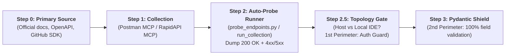

# API Discovery & Two-Layer Shield Integration Framework

> **Purpose:** The engineering standard for integrating third-party and legacy APIs (Stripe, Google APIs, Meta, Booking.com, CRMs, ERPs) into multi-agent systems with fault tolerance, zero secret leaks, and Google Cloud observability.

---

## 🏗️ 3-Tier Anatomy & Progressive Disclosure

```text
api-discovery/
├── SKILL.md                                 # [Tier 1 + Tier 2] Master methodology and 3 integration phases
├── scripts/
│   └── probe_endpoints.py                   # [Tier 3] Universal endpoint auto-probing runner
└── examples/
    └── pydantic_shield_example.py           # [Tier 3] Ready-to-use Two-Layer Pydantic Error Shield template
```

---

## 🔄 The Master 3-Phase Integration Pipeline

```text
[ Phase 1: API Discovery & Full Probe (Step 0 ➔ Step 1 ➔ Step 2) ]
                              │
                              ▼
[ Phase 2: Layer 1 - Deterministic Code & Observability Shield (tools.py) ]
                              │
                              ▼
[ Phase 3: Layer 2 - Cognitive Instruction Shield (agent.py) ]
```

---

## 🚨 MANDATORY LAW: First-Touch Full Field & Error Coverage Audit

> **First-Touch Full Field & Error Audit Law:**
> 1. 🛑 **NEVER guess payload fields or draft partial Pydantic schemas ad-hoc.**
> 2. 🔍 **Full primary source audit:** The engineer or agent MUST first inspect official developer documentation and all raw endpoints from the provider (Step 0).
> 3. 📦 **Collect 100% response structures for BOTH scenarios:**
>    - **Success payloads (`200 OK`):** All useful fields (IDs, nested entities, pricing breakdowns, canonical URLs).
>    - **Error structures (`400`, `401`, `403`, `404`, `429`, `500`):** Exact vendor error payloads (e.g. `{"error": {"code": "...", "message": "..."}}`).
> 4. 🛡️ **Full Pydantic Shield on the first pass:** Build an exhaustive Pydantic model on the very first iteration, ready to parse both `200 OK` and `429/500` without crashing.

---

## 📌 Phase 1: API Discovery & Probing Workflow



### Step 0 — Primary Official API Source Discovery
1. **Official developer documentation lookup:**
   - Locate official developer portals (`developers.google.com`, `stripe.com/docs/api`, `developers.facebook.com`).
   - Audit endpoint specifications, authentication requirements, query params, and `200 OK` vs `4xx/5xx` error payloads.
2. **OpenAPI / Swagger specs and GitHub SDKs (`gh` CLI):**
   - Fetch `openapi.json`, `swagger.yaml` or review official provider SDKs via GitHub code search.
3. **Only after inspecting the official primary source**, proceed to live probing.

### Step 1 — Locate / Import Collection via Postman MCP
1. **Search collections:** Query `postman MCP → search_public_collections(name="<provider name>")`.
2. **Fallback:** If no public collection exists, import `openapi.json` or create a scoped collection via `postman MCP → create_collection`.

### Step 2 — Automated Probing & Response Capture (`scripts/probe_endpoints.py`)
1. Run automated batch endpoint probing using `scripts/probe_endpoints.py`.
2. Capture the actual response dump (`raw_endpoints_audit.json`) covering `200 OK` success and `401/429/500` error structures.

---

### 🛡️ Step 2.5 — Deployment Topology & Ingress Auth Decision Gate

> [!IMPORTANT]
> **MANDATORY ARCHITECTURE DECISION BEFORE WRITING PYDANTIC SHIELDS:**
> Clarify deployment topology before exposing endpoints:
> *Local IDE testing (`adk run`, `localhost`)* vs *Hosted environment (Cloud Run / VPS / public server)*.

#### Architectural Branching Rules:
1. **Local in IDE (`adk run`, `localhost`, CLI tests):**
   * Endpoints are not exposed to the internet.
   * Direct model validation without mandatory auth headers for rapid iteration.
2. **Hosted Deployment (Cloud Run / VPS / Server):**
   * **1st Line of Defense (BEFORE Pydantic):** Raw endpoints must never be public without authentication guards (`Header(x_internal_secret)` or `Authorization: Bearer <ID_TOKEN>`) via `Depends()`.
   * **2nd Line of Defense:** Only after token verification is the request passed to the Pydantic shield for schema contract validation.
   * **Network level:** Dedicated internal tools must use `--ingress internal` without granting `allUsers`.

---

### Step 3 — Automated Contract Generation (`datamodel-codegen`)

> 🛑 **NEVER type Pydantic models manually.** Manual typing causes dropped vendor fields (`warningCode`, `detailedDescription`, `transactionId`, `rateLimitRemaining`).

#### 🔒 Zero-Install Sandbox Execution
```bash
uvx --from datamodel-code-generator datamodel-codegen \
  --input raw_endpoints_audit.json \
  --input-file-type json \
  --output generated_models.py \
  --output-model-type pydantic_v2.BaseModel \
  --use-annotated \
  --snake-case-field \
  --use-subclass-enum \
  --use-default \
  --disable-timestamp
```

---

## 🛡️ Phase 2: Layer 1 — Deterministic Code & Observability Shield (`tools.py`)

Using the models from `datamodel-codegen`, wrap all calls in a Two-Layer Shield (see `examples/pydantic_shield_example.py`):

### 1. Pydantic Two-Layer Shield Return Contract
```python
from typing import Generic, TypeVar, Literal
from pydantic import BaseModel, Field

T = TypeVar("T")

class ServiceResult(BaseModel, Generic[T]):
    data: T | None = Field(default=None, description="Typed entity payload (Layer 1)")
    source_status: Literal["OK", "BUSINESS_ERROR", "AUTH_ERROR", "CONNECTION_PENDING", "RATE_LIMITED", "TIMEOUT", "FALLBACK"] = Field(
        default="OK",
        description="Normalized source status for business logic and LLM"
    )
    error_type: str | None = Field(default=None, description="Machine-readable error code")
    error_message: str | None = Field(default=None, description="Technical error description")
    warning_note: str | None = Field(default=None, description="Calm, non-panicking message for end users")
    transaction_id: str | None = Field(default=None, description="End-to-end transaction ID for vendor support")
```

### 1.5. Network Resilience (Timeouts, Circuit Breakers & Safe HTTP Client)

```python
import httpx

# Strict network limits: 3s connect, 8s read
TIMEOUT_CONFIG = httpx.Timeout(10.0, connect=3.0, read=8.0)

async def call_external_api(url: str, payload: dict) -> ServiceResult[MyModel]:
    try:
        async with httpx.AsyncClient(timeout=TIMEOUT_CONFIG) as client:
            resp = await client.post(url, json=payload)
            
            if resp.status_code == 200:
                return ServiceResult(data=MyModel.model_validate(resp.json()), source_status="OK")
            elif resp.status_code == 429:
                return ServiceResult(source_status="RATE_LIMITED", warning_note="Provider rate limit reached. Cached data applied.")
            else:
                return ServiceResult(source_status="BUSINESS_ERROR", error_type=f"HTTP_{resp.status_code}")
                
    except httpx.TimeoutException:
        return ServiceResult(
            source_status="TIMEOUT",
            warning_note="External service timeout. Switched to fallback source."
        )
    except httpx.NetworkError:
        return ServiceResult(
            source_status="CONNECTION_PENDING",
            warning_note="Network connection failure with third-party service."
        )
```

### 2. Structured Cloud Logging (Zero Leak)
```python
def log_cloud_event(severity: str, event_name: str, **kwargs):
    """Emits structured JSON logs for Google Cloud Logging with secret masking."""
    log_entry = {
        "timestamp": datetime.utcnow().isoformat() + "Z",
        "severity": severity.upper(),
        "event": event_name,
        **sanitize_data(kwargs)
    }
    print(json.dumps(log_entry, ensure_ascii=False), flush=True)
```

---

## 🧠 Phase 3: Layer 2 — Cognitive Instruction Shield (`agent.py`)

Instruct the LLM in system instructions (`agent.py`) how to handle shielded statuses:

```markdown
# Error Handling & Degradation Rules
- If a tool returns `source_status='PARTNER_API_UNAVAILABLE'` or `SERVICE_DEGRADED`:
  ➔ Do NOT panic or display raw system stack traces or HTTP 500 error codes to the user.
  ➔ Communicate the calm fallback from `warning_note` and reference `transaction_id`.
  ➔ Provide actionable solutions based on available cached data.

- If a tool returns `error_type='auth_expired'`:
  ➔ Request credentials renewal politely without retrying blindly in a loop.
```

---

## 📋 Complete Master Checklist

- [ ] **Phase 1 (Step 0 Official Source Discovery):** Official developer portal, OpenAPI specifications, or official GitHub SDK reviewed before testing.
- [ ] **Phase 1 (First-Touch Full Audit):** Real payload dumps for success (`200 OK`) and error states (`400/401/403/404/429/500`) captured via `scripts/probe_endpoints.py` or Postman MCP.
- [ ] **Phase 1 (Step 2.5 Ingress & Topology Gate):** Deployment topology confirmed. For hosted deployments, auth guards (`Depends(verify_internal_secret)`) are mounted BEFORE Pydantic.
- [ ] **Phase 2 (Automated datamodel-codegen):** Pydantic v2 models generated automatically with 100% of fields and aliases preserved.
- [ ] **Phase 2 (Network Resilience & Timeouts):** Explicit timeouts configured with graceful degradation to `ServiceResult(source_status="TIMEOUT")`.
- [ ] **Phase 2 (Two-Layer Shield Wrapper):** All models wrapped in `ServiceResult[T]` with normalized status fields.
- [ ] **Phase 2 (Zero Leak Logging):** `log_cloud_event` logs latency, statuses, and transactions with strict credential masking (`[REDACTED]`).
- [ ] **Phase 3 (Layer 2 Shield):** Agent instructions trained to interpret `source_status` gracefully without runtime panic.
