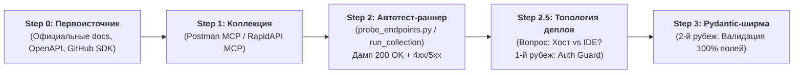

# API Discovery & Two-Layer Shield Integration Framework

> **Назначение:** Инженерный стандарт интеграции сторонних API (Stripe, Google APIs, Booking.com, Etsy, CRM и др.) в мультиагентные системы Google ADK с защитой от сбоев, нулевыми утечками секретов и обсервабилити Google Cloud.

---

## 🏗️ 3-Tier Anatomy & Progressive Disclosure

```text
api-discovery/
├── SKILL.md                                 # [Tier 1 + Tier 2] Главная методология и 3 фазы интеграции
├── scripts/
│   └── probe_endpoints.py                   # [Tier 3] Универсальный раннер автотестирования эндпоинтов
└── references/
    ├── pydantic_shield_template.py          # [Tier 3] Готовый шаблон Two-Layer Pydantic Error Shield
    └── google_travel_multi_aggregator.md    # [Tier 3] Кейс: Мультиагрегатор Google Travel (0% расходов API)
```

---

## 🔄 The Master 3-Phase Integration Pipeline

```text
[ Phase 1: API Discovery & Full Probe (Step 0 ➔ Step 1 ➔ Step 2) ]
                              │
                              ▼
[ Phase 2: Layer 1 - Deterministic Code & Observability Shield (tools.py) ]
                              │
                              ▼
[ Phase 3: Layer 2 - Cognitive Instruction Shield (agent.py) ]
```

---

## 🚨 MANDATORY LAW: First-Touch Full Field & Error Coverage Audit

> **Правило первого касания (First-Touch Full Field & Error Audit Law):**
> 1. 🛑 **ЗАПРЕЩЕНО гадать над полями и верстать частичные Pydantic-схемы "на коленке".**
> 2. 🔍 **Полный аудит первоисточника:** Агент ОБЯЗАН сначала получить официальную документацию и список ВСЕХ сырых эндпоинтов провайдера (Step 0).
> 3. 📦 **Сбор 100% структур ответа для ОБОИХ сценариев:**
>    - **Успешные отклики (`200 OK`):** Все полезные поля сырого ответа (категории, виды, разбивку цен по агрегаторам, канонические URL, HD-фото).
>    - **Сырые структуры ошибок (`400`, `401`, `403`, `404`, `429`, `500`):** Точные имена полей ошибок провайдера (например: `{"error": {"code": "...", "message": "..."}}`).
> 4. 🛡️ **Полная Pydantic-ширма с первого раза:** Сверстать исчерпывающую Pydantic-модель с первого касания, готовую парсить как успех `200 OK`, так и структуры ошибок `429/500` без падений!

---

## 📌 Phase 1: API Discovery & Probing Workflow



### Step 0 — Primary Official API Source Discovery (Первоисточник API)
1. **Поиск официального портала разработчиков (`search_web` / `read_url_content`):**
   - Найти официальную документацию создателя API (например: `developers.google.com`, `stripe.com/docs/api`, `developers.booking.com`).
   - Изучить официальные спецификации эндпоинтов, параметры, типы авторизации и структуры ответов `200 OK` и ошибок `4xx/5xx`.
2. **Проверка OpenAPI / Swagger и GitHub SDK (`gh` CLI):**
   - Запросить `openapi.json`, `swagger.yaml` или найти официальный SDK провайдера через `gh repo view` / `gh code search`.
3. **Только после получения официального первоисточника** переходить к тестированию через Postman MCP или RapidAPI MCP!

### Step 1 — Locate / Import Collection via Postman MCP
1. **Primary Postman Search:** Вызвать `postman MCP → search_public_collections(name="<provider name>")`.
2. **Fallback:** При отсутствии готовой коллекции импортировать `openapi.json` или создать коллекцию через `postman MCP → create_collection`.

### Step 2 — Automated Probing & Response Capture (`scripts/probe_endpoints.py`)
1. Запустить пакетный сквозной прогон эндпоинтов через `postman MCP → runCollection` или скрипт [`scripts/probe_endpoints.py`](scripts/probe_endpoints.py).
2. Зафиксировать реальный дамп ответов (`raw_endpoints_audit.json`) для успехов `200 OK` и ошибок `401/429/500`.

---

### 🛡️ Step 2.5 — Deployment Topology & Ingress Auth Decision Gate (Хост vs Локально)

> [!IMPORTANT]
> **ОБЯЗАТЕЛЬНЫЙ ВОПРОС ПЕРЕД СОЗДАНИЕМ PYDANTIC-ШИРМЫ И FASTAPI ЭНДПОИНТОВ:**
> Перед тем как писать Pydantic-модели и подключать создаваемый инструмент/сервис в код, ассистент **ОБЯЗАН уточнить у пользователя топологию деплоя:**
> 
> *«Как планируется управлять и запускать этот сервис/агент: **локально в IDE (для тестов)** или **деплоить на хост (Cloud Run / VPS / публичный сервер)**?»*

#### Архитектурное правило ветвления:
1. **Вариант А: Локально в IDE (`adk run`, `localhost`, CLI тесты):**
   * Эндпоинты не торчат в интернет.
   * Допустимо подключать Pydantic-схему напрямую без обязательного навешивания заголовков авторизации для ускорения прототипирования.
2. **Вариант Б: Деплой на ХОСТ (Cloud Run / VPS / Сервер):**
   * **1-й Рубеж Обороны (ДО Pydantic!):** Запрещено отдавать сырой эндпоинт наружу! Обязательно вешается авторизационный Guard (`Header(x_internal_secret)` или `Authorization: Bearer <ID_TOKEN>`) через `Depends()`.
   * **2-й Рубеж Обороны:** Только после успешной проверки ключа запрос передается в Pydantic-ширму для валидации контракта.
   * **Сетевой уровень:** Для вспомогательных микросервисов инструментов выставляется `--ingress internal` без прав `allUsers`.

---

### Step 3 — Automated Contract Generation (`datamodel-codegen`)
> 🛑 **ЗАПРЕЩЕНО верстать Pydantic-схемы вручную.** Ручной набор приводит к потере служебных полей (`warningCode`, `detailedDescription`, `transactionId`, `msrp`).

#### 🔒 Безопасный запуск без загрязнения системы (Zero-Install Sandbox)
> ⚠️ **Безопасность окружения:** Никогда не устанавливайте утилиту через глобальный `pip install` в систему. Используйте изолированный запуск на лету:

1. **Рекомендуемый (мгновенный запуск в изолированной песочнице без установки):**
   ```bash
   uvx --from datamodel-code-generator datamodel-codegen \
     --input raw_endpoints_audit.json \
     --input-file-type json \
     --output generated_models.py \
     --output-model-type pydantic_v2.BaseModel \
     --use-annotated \
     --snake-case-field \
     --use-subclass-enum \
     --use-default \
     --disable-timestamp
   ```

2. **Альтернативный (через pipx run):**
   ```bash
   pipx run datamodel-code-generator \
     --input raw_endpoints_audit.json \
     --input-file-type json \
     --output generated_models.py \
     --output-model-type pydantic_v2.BaseModel \
     --use-annotated \
     --snake-case-field \
     --use-subclass-enum \
     --use-default \
     --disable-timestamp
   ```

3. **Внутри локального venv проекта:**
   ```bash
   # Активировать локальный venv проекта
   pip install datamodel-code-generator
   datamodel-codegen --input raw_endpoints_audit.json --input-file-type json --output generated_models.py --output-model-type pydantic_v2.BaseModel --use-annotated --snake-case-field --use-default --disable-timestamp
   ```

---

## 🛡️ Phase 2: Layer 1 — Deterministic Code & Observability Shield (`tools.py`)

На основе сгенерированных моделей от `datamodel-codegen` создается двухслойная ширма (см. шаблон [`references/pydantic_shield_template.py`](references/pydantic_shield_template.py)):

### 1. Pydantic Two-Layer Shield Return Contract
```python
from typing import Generic, TypeVar, Literal
from pydantic import BaseModel, Field

T = TypeVar("T")

class ServiceResult(BaseModel, Generic[T]):
    data: T | None = Field(default=None, description="Типизированная полезная нагрузка сущности (Layer 1)")
    source_status: Literal["OK", "BUSINESS_ERROR", "AUTH_ERROR", "CONNECTION_PENDING", "RATE_LIMITED", "TIMEOUT", "FALLBACK"] = Field(
        default="OK",
        description="Нормализованный статус источника для бизнес-логики и LLM"
    )
    error_type: str | None = Field(default=None, description="Машиночитаемый код ошибки")
    error_message: str | None = Field(default=None, description="Техническое описание ошибки")
    warning_note: str | None = Field(default=None, description="Мягкое объяснение для пользователя без паники")
    transaction_id: str | None = Field(default=None, description="Сквозной Transaction ID для саппорта поставщика")
```

### 1.5. Сетевая устойчивость (Timeouts, Circuit Breaker & Safe HTTP Client)

> [!IMPORTANT]
> **ПРАВИЛО ЗАЩИТЫ ОТ ТАЙМАУТОВ И ЗАВИСАНИЙ:**
> Запрещено делать «голые» вызовы `requests.get()` или `urllib.request` без явного таймаута. Если сторонний API зависнет, ваш контейнер Cloud Run / FastAPI исчерпает пул потоков и упадет сам.

#### Эталонный вызов с таймаутами и перехватом падений (`httpx` / `requests`):
```python
import httpx

# Жесткие тайм-лимиты: коннект 3 сек, чтение 8 сек
TIMEOUT_CONFIG = httpx.Timeout(10.0, connect=3.0, read=8.0)

async def call_external_api(url: str, payload: dict) -> ServiceResult[MyModel]:
    try:
        async with httpx.AsyncClient(timeout=TIMEOUT_CONFIG) as client:
            resp = await client.post(url, json=payload)
            
            if resp.status_code == 200:
                return ServiceResult(data=MyModel.model_validate(resp.json()), source_status="OK")
            elif resp.status_code == 429:
                return ServiceResult(source_status="RATE_LIMITED", warning_note="Сервер перегружен. Используем кэш.")
            else:
                return ServiceResult(source_status="BUSINESS_ERROR", error_type=f"HTTP_{resp.status_code}")
                
    except httpx.TimeoutException:
        # 🛡️ Плавная деградация при таймауте без падения приложения
        return ServiceResult(
            source_status="TIMEOUT",
            warning_note="Внешний сервис временно не отвечает. Переключено на резервный источник."
        )
    except httpx.NetworkError:
        return ServiceResult(
            source_status="CONNECTION_PENDING",
            warning_note="Сетевой сбой соединения со сторонней платформой."
        )
```

### 2. Postman MCP Mocking & Isolated Testing
Для оффлайн-разработки и безопасных тестов без расхода квот создайте Mock Server через Postman MCP:
1. Вызвать `postman MCP → createMock` на основе сохраненной коллекции.
2. Протестировать работу ширмы на всех сценариях (`200 OK`, `401`, `429`, `500`) до выката на боевой шлюз.

### 3. Backend Structured Cloud Logging (Zero Leak)
```python
def log_cloud_event(severity: str, event_name: str, **kwargs):
    """Выводит структурированный лог для Google Cloud Logging с маскированием секретов."""
    log_entry = {
        "timestamp": datetime.utcnow().isoformat() + "Z",
        "severity": severity.upper(),
        "event": event_name,
        **sanitize_data(kwargs)
    }
    print(json.dumps(log_entry, ensure_ascii=False), flush=True)
```

---

## 🧠 Phase 3: Layer 2 — Cognitive Instruction Shield (`agent.py`)

Обучите LLM в системном промпте (`agent.py`) корректно реагировать на статусы Pydantic-ширмы:

```markdown
# Error Handling & Degradation Rules
- Если инструмент вернул `source_status='PARTNER_SAP_UNAVAILABLE'` или `SERVICE_DEGRADED`:
  ➔ НЕ паникуй и не показывай пользователю системные трейсы или коды ошибок (HTTP 500).
  ➔ Используй мягкое примечание из `warning_note` и укажи `transaction_id`.
  ➔ Предложи пользователю готовое решение на основе доступных данных.

- Если инструмент вернул `error_type='auth_expired'`:
  ➔ Вежливо попроси пользователя обновить авторизацию или проверить учетные данные.
```

---

## 📋 Complete Master Checklist

- [ ] **Phase 1 (Step 0 Official Source Discovery):** Официальный портал разработчиков, OpenAPI/Swagger спецификации или официальный GitHub SDK изучены ДО вызовов Postman или MCP.
- [ ] **Phase 1 (First-Touch Full Audit):** Сырые структуры успехов (`200 OK`) и ошибок (`400/401/403/404/429/500`) зафиксированы через [`scripts/probe_endpoints.py`](scripts/probe_endpoints.py) или Postman MCP.
- [ ] **Phase 1 (Step 2.5 Ingress & Topology Gate):** Задан вопрос: *«Хост или локально в IDE?»*. При деплое на хост ДО Pydantic повешен авторизационный `Depends(verify_internal_secret)`.
- [ ] **Phase 2 (Automated datamodel-codegen):** Pydantic v2 модели сгенерированы утилитой `datamodel-codegen` с сохранением 100% полей, алиасов и вложенных структур.
- [ ] **Phase 2 (Network Resilience & Timeouts):** Вызовы защищены явным `TIMEOUT_CONFIG` и блоками перехвата `TimeoutException` с плавной деградацией в `ServiceResult(source_status="TIMEOUT")`.
- [ ] **Phase 2 (Two-Layer Shield Wrapper):** Модель обернута в `ServiceResult[T]` со статусами `source_status`, `error_type`, `warning_note` и `transaction_id`.
- [ ] **Phase 2 (Postman MCP Mocking):** Создан Mock Server для оффлайн-тестирования граничных сценариев (4xx/5xx).
- [ ] **Phase 2 (Zero Leak Logging):** `log_cloud_event` логирует задержки `latency_ms`, статусы и транзакции с маскированием паролей и токенов (`[REDACTED]`).
- [ ] **Phase 3 (Layer 2 Shield):** Системная инструкция агента обучена читать `source_status` и информировать пользователя без технических паник.
- [ ] **Phase 3 (Planner Option):** `BuiltInPlanner` включен, если работа с API требует многошагового рассуждения.
