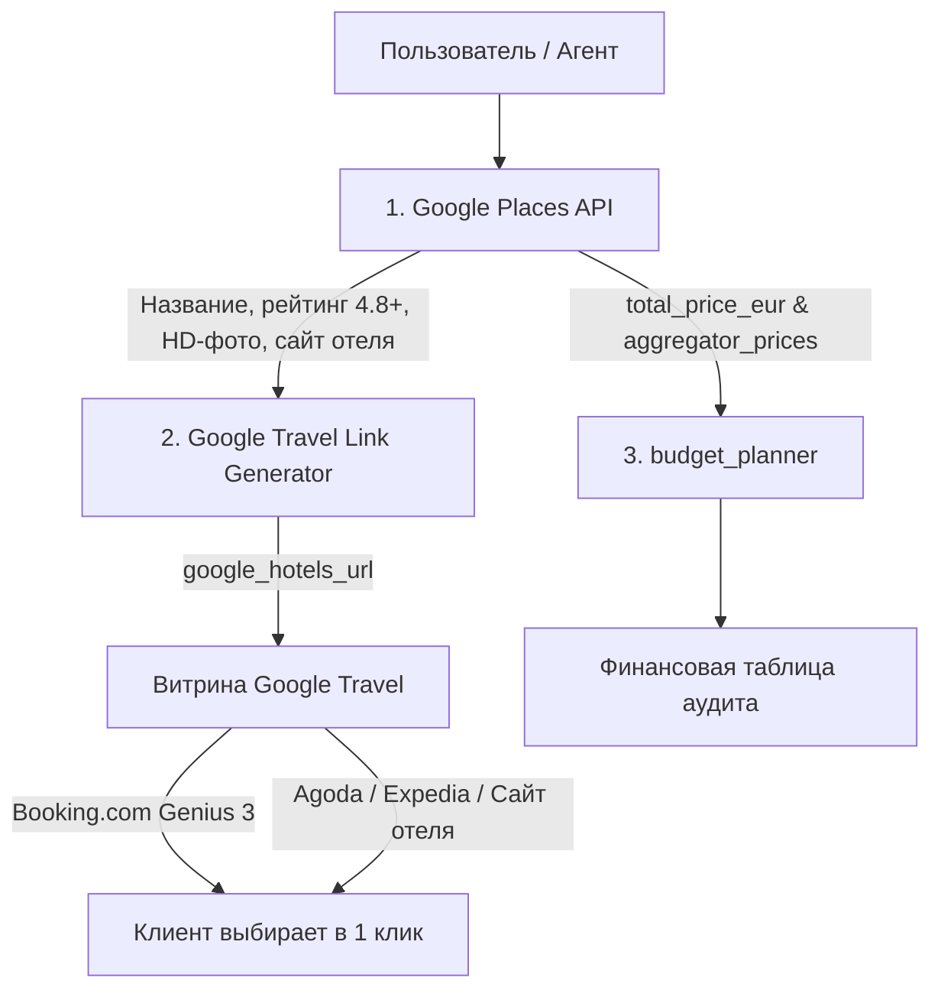

# Google Travel Multi-Aggregator Discovery Protocol (Zero-Cost API Case Study)

This reference documents the architectural design pattern for zero-cost, multi-aggregator travel data extraction using Google Places API and Google Travel Links.

---

## 🏛️ Architecture Overview

---

## 🔑 Key Components

1. **Google Places API (`gmaps.places` / `gmaps.place`):**
   - Retrieves fundamental ground-truth attributes: hotel name, verified Google review rating (4.8+), coordinates, place ID, photos, and direct official hotel website (`website`).
   - Cost: Standard Google Maps API pricing (0% third-party subscription overhead).

2. **Google Travel Multi-Aggregator URL (`google_hotels_url`):**
   - Generates the dynamic URL: `https://www.google.com/travel/hotels/{destination}?q={hotel_name}`
   - Shows live rate comparison across **Booking.com, Agoda, Expedia, and Direct Hotel Website**.
   - Preserves user loyalty status (e.g. Booking.com Genius Level 3).

3. **Aggregator Prices Breakdown (`aggregator_prices`):**
   - Enables immediate financial audit for the accountant agent (`budget_planner`) with estimated and live discounts without making redundant billable external requests.

4. **Optional Live Enrichment:**
   - External OTA endpoints (e.g. Booking.com API `getHotelDetails`) are triggered **only** when `enrich_live_price=True` is explicitly passed.
